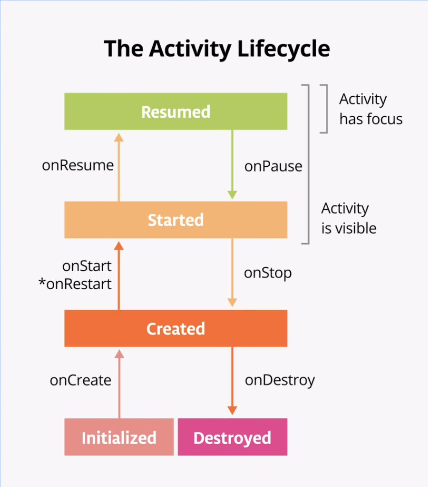

# Test

테스트 페이지
 관심사 분리

관심사 분리 디자인 원칙은 각각 별개의 책임이 있는 여러 함수 클래스로 앱을 나눠야 한다는 원칙입니다.

모델에서 UI 만들기

모델에서 UI 만들기 원칙은 모델(가능한 경우 영구 모델)에서 UI를 만들어야 한다는 원칙입니다. 모델은 앱의 데이터 처리를 담당하는 구성요소로, 앱의 UI 요소 및 앱 구성요소와 독립되어 있으므로 앱의 수명 주기 및 관련 문제의 영향을 받지 않습니다.

UDF 패턴 (단방향 데터 흐름 패턴)
상태는 아래로 이동하고, 이벤트는 위로 올라가는 디자인 패턴

ViewModel
애플리케이션의 비즈니스 로직을 처리하는 방법.

화면 회전 등의 컴포저블의 변경이 일어날 때, 입력된 값을 유지하기 위한 방법

ViewModel의 수명주기
ViewMdodel은 액티비티가 생성될 때 같이 생성되고, 액티비티가 소멸될 때 같이 소멸이 됨.

### 안드로이드의 수명 주기 (Life Cycle)

안드로이드에서는 onCreate() 메소드가 어플의 진입점임.
활동이 다른 활동으로 이동할 때 콜백 메소드를 호출함.

모든 수명 주기 메소드들은 오버라이드할 때 슈퍼클래스의 메소드를 즉시 호출해야 한다.
onCreate() : 활동이 처음 시작할 때 호출됨. 수명주기에서 한번만 호출됨. 
onStart() : onCreate() 직후에 호출이 됨. 활동에 ui가 보이긴 하지만 아직 사용자와 상호작용이 불가능한 상태임. 수명 주기에 따라 여러번 호출이 될 수 있음.
onResume() : 활동에 ui가 표시되고 사용자와 상호작용이 가능한 상태
onRestart() : onStop()이 호출되어 활동이 중단된 후 다시 시작할 때
onDestroy() : 활동이 소멸될 때 호출됨. 객체들이 가지고 있는 자원을 무효화하거나 회수한다.

finish() 메소드를 호출하거나, 어플이 응답하지 않는 경우 활동을 종료할 수 있음
onStop()까지는 활동이 아직 소멸되지 않은 상태. 화면에서 보이지는 않지만 백그라운드에 Activity 객체가 존재함.

포그라운드 전체 기간 : 활동이 모두 사용자에게 표시되고 포커스를 유지하는 기간.

기기 회전 시 액티비티를 소멸하고 다시 생성함.

`remember` : 화면 구성 변경 시 저장된 값을 저장하지 못함.

`rememberSavable` : 활동이 소멸되는 경우에도 사용자가 입력한 값을 계속 유지 가능.

## Logcat

클래스 Log : Logcat에 메시지를 쓰는 역할.

Log.*(태그, 메시지)
Log.v : 상세 메시지를 기록
Log.d : 디버그 메시지를 기록
Log.i : 정보 메시지
Log.w : 경고 메시지
Log.e : 오류 메시지

## StateFlow

대부분의 UI는 정적이지 않기 때문에 

## 적응형 앱

중단점 : 안드로이드 화면 크기에 따라 ui를 다르게 표시할 수 있도록 설정한 포인트