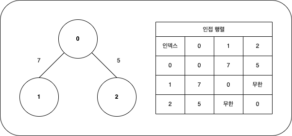

## 스택, 큐

### 스택(stack)
후입선출 (LIFO) 구조의 자료구조  
파이썬에서는 별도의 라이브러리 없이 리스트의 `append()`, `pop()` 메소드를 사용하여 스택을 구현할 수 있다.

삽입 연산 : append()  
삭제 연산 : pop()

~~~python
stack = []
stack.append(1) #1을 스택에 삽입, [1]
stack.append(3) #3을 스택에 삽입, [1,3]
stack.append(4) # [1,3,4]
stack.append(7) # [1,3,4,7]           
stack.pop()     #스택에서 원소를 꺼냄   [1,3,4]
stack.append(5) # [1,3,4,5]
print(stack)    #스택을 출력
~~~
>[1,3,4,5]

### 큐(queue)
선입선출 (FIFO) 구조의 자료구조  
`collections` 모듈의 `deque`를 활용하는 것이 속도와 편의성 측에서 좋음.  

삽입 연산 : append()  
삭제 연산 : popleft()  

`list(deque)`로 deque 객체를 리스트로 변환할 수 있다.  

---

## 재귀함수  

자기 자신을 호출하는 함수  
재귀함수는 호출 스택 사용.  
DFS가 재귀함수를 사용

---
## 그래프 (Graph)

정점(Vertex)와 간선(Edge)로 이루어진 구조  
정점은 노드(Node)라고도 불린다.

프로그래밍에서 그래프를 표현하는 방식  

- 인접 행렬 (Adjacency Matrix) : 2차원 배열을 사용하여 그래프를 표현하는 방식  

연결되지 않은 노드의 값은 무한으로 표시함. 보통 논리적으로 나올 수 없는 값(99999999, 987654321 등)으로 설정함

- 인접 리스트 (Adjacency list) : 리스트를 사용하여 그래프를 표현하는 방식

메모리 효율 측면에서: 인접행렬 < 인접리스트  
접근 속도 측면에서 : 인접행렬 > 인접리스트

## DFS, BFS

### DFS

깊이 우선 탐색

1. 처음 탐색하는 노드를 스택에 삽입 후 방문 처리
2. 스택 최상단 노드에 방문하지 않은 노드가 있으면, 그 노드를 스택에 삽입 후 방문 처리  
방문하지 않은 노드가 여러 개인 경우 보통 낮은 번호부터 처리함  
방문하지 않은 노드가 없으면 스택에서 노드를 꺼냄
3. 모든 노드를 탐색할 때까지 **2**번을 반복

### BFS

너비 우선 탐색

1. 처음 탐색하는 노드를 큐에 삽입 후 방문 처리
2. 노드를 꺼낸 후 인접한 노드들을 모두 큐에 삽입
3. 모든 노드를 탐색할 때까지 **2**번을 반복

`deque`라이브러리를 사용하는 것이 좋으며, `O(N)`의 시간이 소요됨.  
일반적인 경우 실제 수행 시간은 DFS보다 좋음.  

1차원, 2차원 배열을 그래프로 생각하면 문제를 수월하게 해결할 수 있음.   