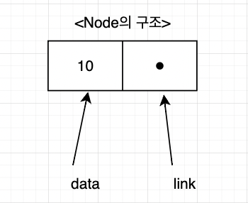

## 리스트

순서를 가지는 데이터의 집합을 가리키는 추상 자료형.

리스트를 구현하기 위한 방법으로, 배열을 사용하는 순차 리스트와 데이터의 주소를 사용하는 연결리스트가 있음.

## 리스트의 연산

- 리스트의 앞에 데이터를 추가 또는 삭제
- 리스트의 뒤에 데이터를 추가 또는 삭제
- 리스트의 특정 위치에 데이터를 추가 또는 삭제
- 특정 위치의 데이터를 가져오기

## 순차 리스트

배열을 사용하여 구현하는 리스트

장점 : 원하는 원소의 인덱스를 알고 있다면, 데이터에 바로 접근할 수 있다. (랜덤 액세스 가능)

단점 : 중간에 원소를 삽입하거나 삭제할 경우, 원소의 이동이 발생한다.

이 과정에서 많은 양의 연산이 발생함. O(n)의 시간복잡도.

구현하기는 쉽지만 비효율적.

## 연결 리스트

순차 리스트의 단점을 보완하기 위해 등장한 자료구조.

연결리스트는 노드와 노드를 연결하여 데이터를 저장하는 구조를 가지고 있다.
각 노드는 데이터를 저장하는 데이터 필드와, 이전 또는 이후 노드를 가리키는 하나 이상의 링크 필드로 구성되어 있다.

~~~python
class Node:
    def __init__(self, data, next=None):
        self.data = data
        self.next = next
~~~

- 장점  
연속된 기억공간을 요구하지 않는다. 데이터 추가와 삭제에서 배열보다 자유로움.  

- 단점  
랜덤 엑세스가 불가능하다. (배열의 경우 인덱스 값을 알면 데이터에 바로 접근이 가능함.)  
배열보다 구현하기 어렵다.

연결리스트는 첫번째 노드의 주소는 반드시 기억해야 한다. 그렇지 않으면 전체 데이터를 잃을 가능성이 있기 때문.  
첫번째 노드 (헤드 노드)를 가리키는 포인터를 따로 둔다.

~~~python
class LinkedList:
    def __init__(self):
        self.head = None
        self.cnt = 0
~~~

연결 리스트는 요소를 탐색할 때 헤드 노드부터 출발하여 각 노드를 방문하여 검색해야 한다.   
찾는 데이터가 뒤쪽에 위치한다면 소요되는 시간이 오래 걸릴 수 있다는 것이 불편한 점 

~~~python
class LinkedList:
    
    def add_first(self, data):
        """head 노드 생성"""
        ptr = self.head #새로운 데이터가 삽입되기 이전의 head 노드
        self.head = Node(data, ptr) #새로운 노드를 생성하고, 기존 head 노드와 연결
        self.cnt+=1

    def add_last(self, data):
        """tail 노드 생성"""
        if self.head is None:   #리스트가 비어있는 경우
            self.add_first(data)
        else:
            ptr = self.head
            while ptr.next is not None: #tail 노드를 찾음
                ptr = ptr.next
            ptr.next = Node(data, None) #새로운 tail 노드 생성
            self.no+=1

~~~

## 연결리스트 - 커서

리스트에 저장될 데이터의 숫자를 알고 있다면, 배열을 사용하여 리스트를 구현할 수 있음.

Free List를 두어 빈 공간을 활용할 수 있도록 함.

Free List : 삭제된 레코드의 인덱스를 저장하는 자료구조.

## 원형 연결 리스트 

- 꼬리 노드가 머리 노드를 가리키는 구조를 가지는 자료구조

## 이중 연결 리스트

- 단순 연결 리스트의 단점 : 앞쪽 노드의 데이터를 찾기 어려움. (한번 순회하고 다시 맨 앞부터 찾아야 함)
- 노드가 앞, 뒤 노드를 각각 가리키는 포인터를 가지는 리스트 

## 이중 원형 연결 리스트

원형 리스트 + 이중 연결

