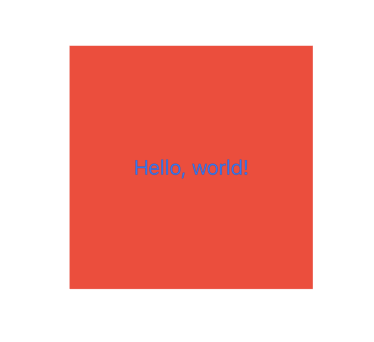
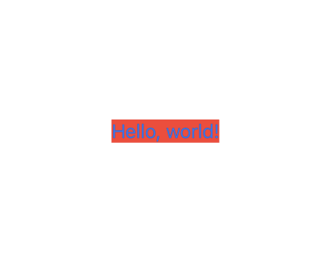

Project 3에서는 뷰와 수정자에 대해 세부적으로 알아보게 된다.

## SwiftUI에서는 왜 View 구성에 Struct를 사용할까

UIKit 또는 AppKit에서는 구조체가 아닌 클래스를 사용하여 뷰를 구성했다.  
하지만 SwiftUI에서는 뷰 구성에 구조체를 사용하는데, 몇 가지의 이유가 있다.

1. 성능  

UIKit에서 뷰를 구성하기 위해서는 많은 프로퍼티와 메소드가 있는 UIView라는 공통적인 클래스를 상속받아야 했다.  
그렇기 때문에, 구현할 뷰에서 UIView 프로퍼티나 메소드 중 일부가 필요없더라도 상속 받아야 했다.  
하지만 SwiftUI에서 구조체를 사용하여 뷰를 구성하기 때문에, 뷰 안에 들어있는 것은 필요한 프로퍼티와 메소드밖에 없다.

2. 상태 분리

구조체를 사용하여 상태와 코드를 분리하여 코드를 간결하게 유지할 수 있다.

## main View 뒤에는 뭐가 있을까

현재로서는 view 뒤에는 아무것도 없다고 생각한다.  

maxWidth, maxHeight : 지정한 공간을 채울 수 있다.  
다른 뷰가 있으면 그 뷰가 공간을 차지할 수 있다.  

width, height : 지정한 공간을 채워야한다.

## 수정자 순서의 중요성

~~~swift
Button("Hello, world!") {
            //아무 동작도 없음
        }
        .background(.red)
        .frame(width: 200, height: 200)
~~~

이 코드를 통해 우리는 200*200의 빨간 사각형이 배경인 버튼이 생성될 것을 기대한다. 그러나 결과는 예상과 빗나간다.

    
    

버튼의 글자 주변에만 빨간 사각형이 생성된다. 왜 그럴까?  

`type(of:)` 함수는 값의 정확한 타입을 출력한다. `type(of:)`를 통해 버튼의 타입을 알아본다.  
버튼 안에 주석을 제거하고 `print(type(of: self.body))`를 추가한다.
 
~~~swift
Button("Hello, world!") {
            print(type(of: self.body))
        }
        .background(.red)
        .frame(width: 200, height: 200)
~~~

이후 에뮬레이터를 실행한 후 버튼을 탭하면, 콘솔창에 다음과 같은 값이 출력된다.

>ModifiedContent<ModifiedContent<Button<Text>, _BackgroundStyleModifier<Color>>, _FrameLayout>

1. 뷰를 수정자를 사용해 수정할 때마다, 제네릭을 사용해 수정자를 적용한다. 
`ModifiedContent<OurThing, OurModifier>`

2. 수정자가 여러개인 경우 스택처럼 쌓이게 된다. `ModifiedContent` 가장 안쪽 수정자부터 적용이 된다.

위쪽 예시에서는...  
ModifiedContent<Button<Text>, _BackgroundStyleModifier<Color>>  
가 먼저 적용이 된다. 이후 _FrameLayout이 적용된다.

버튼만큼의 사이즈를 가지는 빨간색 사각형이 생기고 텍스트를 둘러싼다.  
이후 200*200의 사각형이 생기게 되는데 이 때 빨간색 이외 부분은 흰색(아무것도 없음) 처리된다.

의도한 대로 200*200의 빨간색 사각형이 적용된 버튼이 생기는 결과를 원한다면 `.frame()` 수정자를 `.background()` 수정자 앞에 위치하도록 작성한다.

~~~swift
Button("Hello, world!") {
            print(type(of: self.body))
        }
        .frame(width: 200, height: 200)
        .background(.red)
        
~~~

버튼을 탭하여 적용된 타입을 확인해본다.

> ModifiedContent<ModifiedContent<Button<Text>, _FrameLayout>, _BackgroundStyleModifier<Color>>

200*200의 사각형을 생성하는 `_FrameLayout`이 먼저 적용되고, 이후 배경색을 지정하는 `_BackgroundStyleModifier`가 적용되었다.  

의도한대로 결과가 잘 나온다.

## 뷰 분할

`ContentView` 안의 `body` 프로퍼티 안에 뷰가 너무 많을 때, 뷰를 분할하여 생성하는 것이 가능하다.  
뷰를 분할하면 코드가 간결해질 뿐만 아니라 비슷한 뷰를 여러 개 생성할 때 코드를 여러번 반복하여 입력할 필요가 없어 편리하다.  

1. 커스텀 뷰 구조체 생성  
    커스텀하는 뷰는 View 프로토콜을 준수해야 한다.

2. 커스텀 뷰에 `body` 프로퍼티 생성  
    `body` 프로퍼티 안에 원하는 뷰를 선언한다.

3. `ContentView` 구조체에서 사용
`ContentView` 안의 `body`에서 커스텀 뷰를 생성한다.

## some View의 중요성

`some View`의 의미  
"`View` 프로토콜을 준수하는 객체이지만 정확히 어떠한 타입인지는 명시하지 않겠다"

SwiftUI는 뷰의 변경사항을 알고 있음. -> 뷰를 빠르게 업데이트 가능.

ModifiedContent의 구조. 뷰를 구체적으로 리턴하려고 하면 매우 복잡해짐.

`some View`를 사용하면 복잡하게 작성할 필요 없이 불투명한 타입으로 뷰만 반환해도 되기 때문에 편리해짐.

## TupleView

안에 2개,3개,4개...10개까지의 뷰를 포함할 수 있는 튜플이 생성됨.

## 조건을 사용한 수정자 표현

가장 쉬운 방법은 삼항 조건연산자(`?:`)을 사용하는 것이다.

~~~swift
struct contentView: View {
    @State private var useRedText = false

    var body: some View {
        Button("Click") {
            //useRedText의 값을 변경한다.
            useRedText.toggle()
        }
        .foregroundStyle(useRedText? .red : .blue)
        //useRedText가 true이면 .red, false이면 .blue
    }
}
~~~

여러 조건이 있는 경우 if-else를 사용하는 방법도 있지만, if-else의 경우 뷰 자체를 생성하고 비교, 파괴하는 동작이 추가되기 때문에 삼항 조건연산자를 사용하는 것보다 효율이 낮다.

## Environment Modifier

해당 환경 (environment)의 자식들 뷰에 일괄적으로 적용할 수 있는 수정자이다.

어떤 수정자가 환경 수정자인지, 아니면 일반 수정자인지는 공식 문서를 통해 알아낼 수 있다.

## 프로퍼티처럼 뷰 사용하기

프로퍼티에 뷰를 선언하여 사용하면 코드를 더 깔끔하게 사용할 수 있다.  
수정자를 사용하는 것도 가능하다.

~~~swift
struct contentView: View {
    let motto = Text("Draco dormiens")

    var body: some View {
        VStack {
            motto
                .foregroundStyle(.red)
        }
    }

}

~~~

## 커스텀 뷰

특정 데이터를 제외하고 반복되는 뷰가 있을 때, 직접 작성하는 대신 커스텀 뷰를 사용해 템플릿을 만들고 생성할 수 있다.

~~~swift
struct ContentView: View {
    var body: some View {
        VStack(spacing: 10) {
            Text("First")
                .font(.largeTitle)
                .padding()
                .foregroundStyle(.white)
                .background(.blue)
                .clipShape(.capsule)

            Text("Second")
                .font(.largeTitle)
                .padding()
                .foregroundStyle(.white)
                .background(.blue)
                .clipShape(.capsule)
        }
    }
}
~~~
`Text`의 문자만 바뀌고 다른 수정자들은 그대로인 경우, 이 대신

~~~swift
struct CapsuleText: View {
    //이렇게 따로 구조체를 선언할 수 있다.
    text: String

    var body: some View {
        Text(text)
        .font(.largeTitle)
            .padding()
            .foregroundStyle(.white)
            .background(.blue)
            .clipShape(.capsule)
    }
}

struct ContentView: View {
    var body: some View {
        VStack(spacing: 10) {
            //구조체를 생성하여 사용할 수 있다.
            CapsuleText(text: "First")
            CapsuleText(text: "Second")
                //수정자 또한 오버라이딩할 수 있다.
                .foregroundStyle(.yellow)
        }
    }
}
~~~

## 사용자 정의 수정자

`ViewModifier` 프로토콜을 준수하는 사용자 정의 구조체를 생성할 수 있다.  
`ViewModifier` 프로토콜은 `Content`타입을 매개변수로 받고 `some View` 타입을 리턴하는 `body` 메소드를 구현해야 한다는 요구사항이 있다.

다음의 스타일들을 가지는 `Title` 사용자 정의 수정자를 구현하려면:
~~~swift
.font(.largeTitle)
.foregroundStyle(.white)
.padding()
.background(.blue)
.clipShape(.rect(cornerRadius: 10))
~~~

~~~swift
//Title 사용자 정의 구조체 선언
struct Title: ViewModifier {
    func body(content: Content)->some View {
        content
            .font(.largeTitle)
            .foregroundStyle(.white)
            .padding()
            .background(.blue)
            .clipShape(.rect(cornerRadius: 10))
    }
}
~~~

사용자 정의 구조체는 `.modifier()` 수정자를 통해 사용할 수 있다.

~~~swift
Text("This is title")
    .modifier(Title())
~~~

수정자를 적용할 수 있을 뿐만 아니라 새로운 뷰를 반환할 수도 있다.

### 확장으로 래핑하기

`View`에서 사용하기 쉽게 확장으로 래핑할 수 있다.

`titleStyle()`이라는 메소드로 래핑을 한다.

~~~swift
extension View {
    func titleStyle() -> some View {
        modifier(Title())
    }
}
~~~

래핑을 한 이후에는 이렇게 사용할 수 있다.

~~~swift
Text("This is title")
    .titleStyle()
~~~

`ViewModifier` 프로토콜을 사용하여 구현한 수정자는 자체의 저장 프로퍼티를 가질 수 있지만, `View`를 확장하여 구현하는 경우에는 자체의 저장 프로퍼티를 가질 수 없다.