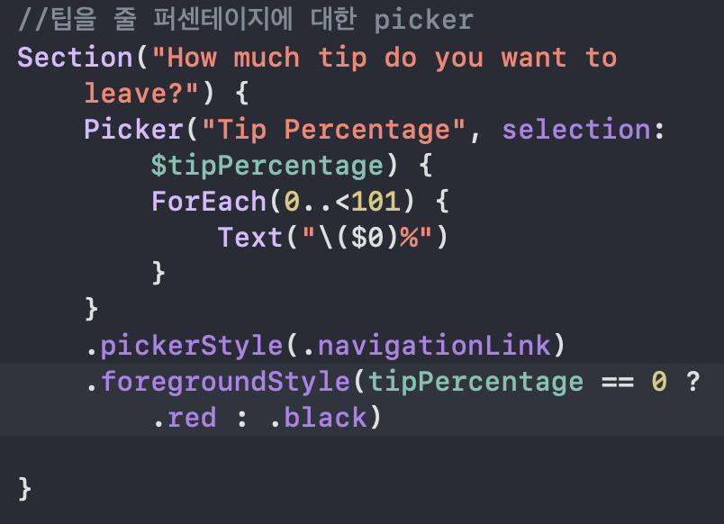
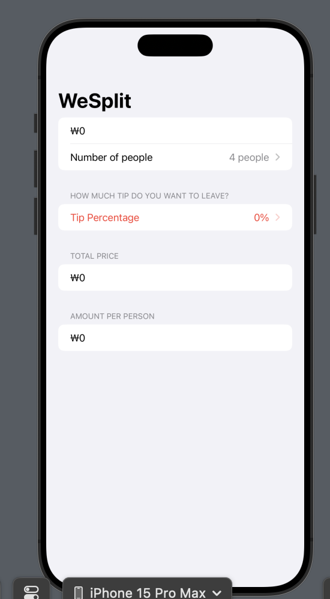
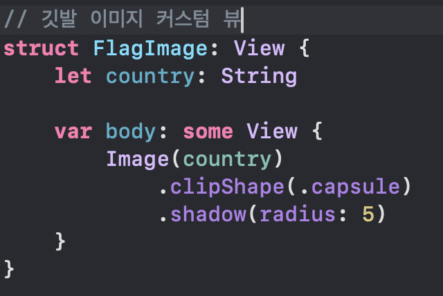
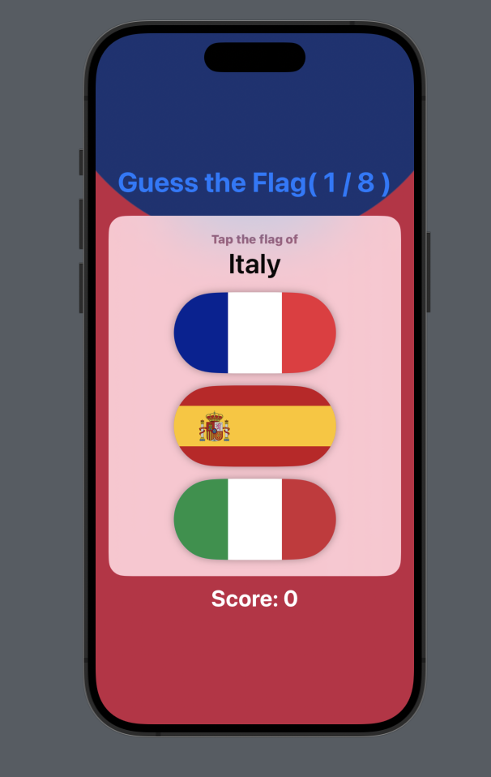

이번 프로젝트의 마지막 장으로, 지금까지 배운 내용들을 지난번에 했던 프로젝트 1, 2에 적용해본다.  

## Challenge

1. Project 1로 톨아가, 팁이 0퍼센트인 경우 텍스트가 빨간색으로 변경되도록 하기
2. Project 2로 돌아가, Image 뷰를 FlagImage() 뷰로 변경하기 (적용했던 수정자들을 포함)
3. 파란색의 큰 폰트의 제목을 만들 수 있는 사용자 정의 수정자를 만들기. ViewModifier를 사용하고 extension으로 래핑해야 한다.

## 문제풀이

*정답이 아닙니다.

- 1번

삼항 연산자를 사용하여 현재 팁 퍼센테이지가 0퍼센트인지 확인하는 코드를 작성하였다.  
이후 `Picker` 뷰에 추가했다.

~~~swift
.foregroundStyle(tipPercentage == 0 ? .red : .black)
~~~

<figure>
    
    <figcaption>코드</figcaption>
</figure>
<figure>
    
    <figcaption>결과</figcaption>
</figure>

- 2번

`contentView`에 있던 `Image`를 사용자 정의 뷰로 따로 구현했다.

`contentView`에서 `Image`를 삭제하고 그 자리에 `FlagImage` 사용자 정의 뷰를 사용했고, 매개변수로 보여줄 국가명을 보냈다.

<figure>
    
    <figcaption>결과</figcaption>
</figure>

- 3번

파란색의 큰 크기의 제목을 가지는 수정자를 정의하기 위해 `BlueLargeTitle`이라는 구조체를 정의하고 `ViewModifier` 프로토콜을 채택했다.

준수해야하는 `body` 메소드에 `.font`와 `.foregroundStyle()`로 스타일을 지정했다.

~~~swift
//커스텀 수정자
struct BlueLargeTitle: ViewModifier {
    func body(content: Content) -> some View {
        content
            .font(.largeTitle
                .weight(.bold))
            .foregroundStyle(.blue)
    }
}
~~~

`extension`을 사용하여 `View`프로토콜에 확장했다. 

~~~swift
//커스텀 수정자를 래핑
extension View {
    func blueLargeTitle() -> some View {
        modifier(BlueLargeTitle())
    }
}
~~~

`contentView`의 타이틀 부분을 사용자 정의 수정자를 사용하는 쪽으로 수정했다.

~~~swift
Text("Guess the Flag( \(stage) / 8 )")
    .blueLargeTitle()
~~~

<figure>
    
    <figcaption>결과</figcaption>
</figure>

---

출처: https://www.hackingwithswift.com/100/swiftui/24