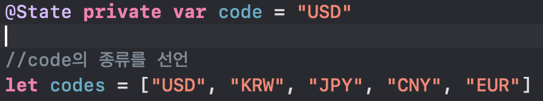
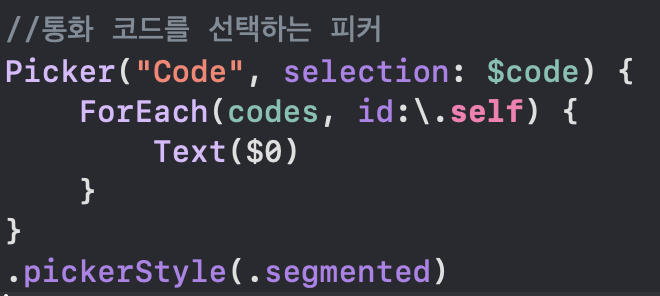
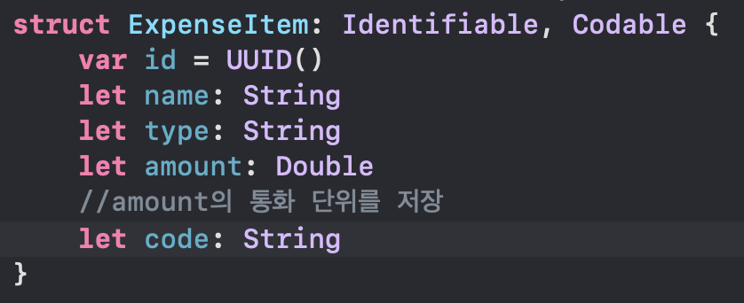
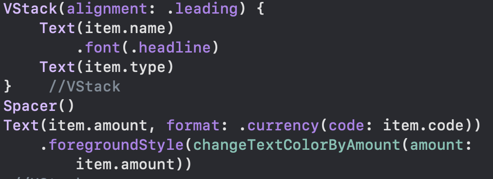
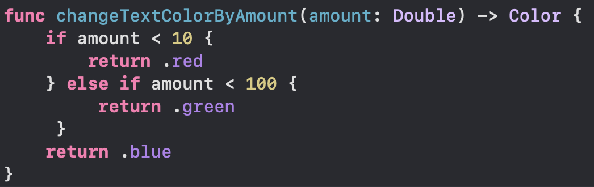
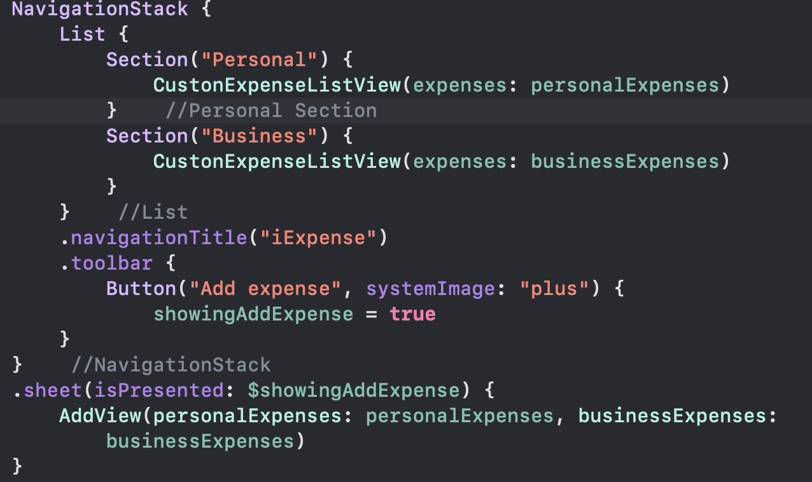
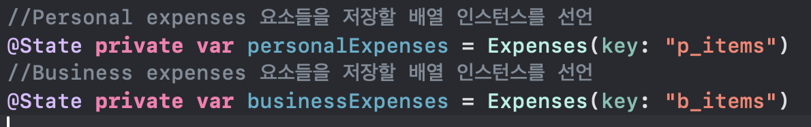
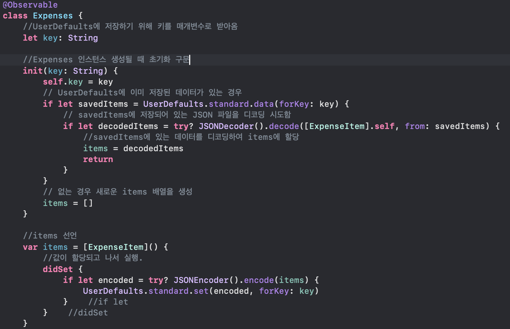

## Project 7, part 3 - Challenge

1. 항상 USD를 표시하는 것 대신 사용자가 통화를 선택하도록 함.
2. 10달러 미만, 100달러 미만, 100달러 이상 세 가지 각각 다른 스타일을 지정하도록 설정. 스타일은 마음대로
3. Personal과 Business 리스트를 나누어서 표시하도록 함.


### 문제 풀이

1번.  
---
여러 통화 단위를 선택할 수 있도록 배열을 사용하여 주요 통화를 정의했다.



이후 AddView에서 통화를 선택할 수 있도록 Picker를 추가했다. 


ExpenseItem에서 통화코드를 저장할 수 있게 프로퍼티를 추가했고, 리스트에서 통화코드를 표시할 수 있도록 수정했다.






2번.
---
입력 값이 10미만, 100미만, 100이상 3구역으로 나눠 각각 .red, .green. .blue의 색상을 가지도록 설정했다. (단위는 무시함)

이를 위해 저장된 값에 따라 색상을 리턴하는 메소드를 작성했다.



3번.
---
리스트를 나누기 전, 리스트 안 요소들을 표시하는 코드를 따로 빼서 새로운 파일로 작성했다.

```swift
//CustomExpenseListView.swift

import SwiftUI
//ContentView에서 리스트
struct CustonExpenseListView: View {
    // Expenses를 받아와야 함
    var expenses: Expenses
    
    var body: some View {
        ForEach(expenses.items) { item in
            HStack {
                VStack(alignment: .leading) {
                    Text(item.name)
                        .font(.headline)
                    Text(item.type)
                }    //VStack
                Spacer()
                Text(item.amount, format: .currency(code: item.code))
                    .foregroundStyle(changeTextColorByAmount(amount: item.amount))
            }    //HStack
        }    //ForEach
        .onDelete(perform: removeItems)
    }
    
    func removeItems(at offsets: IndexSet) {
        expenses.items.remove(atOffsets: offsets)
    }
    
    func changeTextColorByAmount(amount: Double) -> Color {
        if amount < 10 {
            return .red
        } else if amount < 100 {
             return .green
         }
        return .blue
    }
}    //struct

#Preview {
    CustonExpenseListView(expenses: Expenses(key: ""))
}
```

ContentView에서 리스트를 표시하는 부분을 섹션으로 구분한 다음, 해당 뷰의 인스턴스를 생성하는 방식으로 교체했다.



아이템을 저장하는 Expense 클래스를 두 개 생성하여 각각 personal, business를 저장하도록 했다.  
UserDefaults에 저장하는 키를 기존의 `items`로 사용할 경우 리스트가 섞이는 버그가 발생해 각각의 키로 저장할 수 있도록 키를 따로 설정해 넘겨줬다.



`Expense` 클래스의 변경사항



