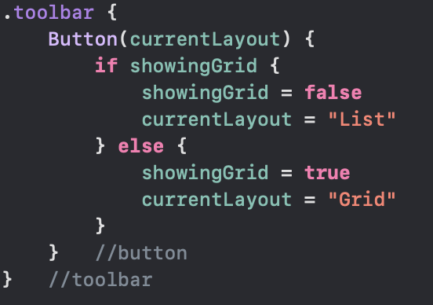

# Day 42: Project 8, part 4

프로젝트 8인 Moonshot 어플을 마무리한다. 배운 내용들을 테스트하고, 챌린지에 도전한다.

# Review

*의역, 오역 다수.

1번.  
option 1: `containerRelativeFrame()`은 뷰의 컨테이너 사이즈를 읽을 수 있게 해준다. (o)  
option 2: 이미지 뷰의 컨텐츠 사이즈를 늘리기 전에, `aspectRatio(contentMode: .resize)`를 사용해야 한다. (x)  
->`aspectRatio()`가 아니라 `resizable()` 수정자를 사용해야 한다.  

2번.  
option 1: 이미지의 너비를 설정할 때, 높이도 같이 설정해야 한다. (x)  
option 2: `LazyHGrid`와 `LazyVGrid`는 `ScrollView` 안에 배치될 수 있다. (o)  
-> 이미지의 너비만 설정할 수도 있고, 높이만 설정할 수도 있고, 둘 다 설정하거나 둘 다 설정하지 않아도 된다.  

3번.  
option 1: Codable은 Swift 코드가 소스 데이터와 일치하는 한 구조체 내에 있는 구조체와 함께 작업할 수 있다. (o)  
option 2: 구조체는 하나의 프로토콜만 준수해야 한다. 두 개 이상은 불가능하다. (x)  
-> 구조체는 여러 개의 프로토콜을 준수할 수 있다.  

4번.  
option 1: 뷰에 `clipped()`를 사용하여 뷰가 항상 프레임 안에 고정되도록 할 수 있다. (o)  
option 2: Scroll View는 가로 혹은 세로로 스크롤할 수 있지만, 동시에는 불가능하다. (x)  
-> 구조체는 여러 개의 프로토콜을 준수할 수 있다.  

5번.  
option 1: 적응형 그리드 항목들은 SwiftUI가 공간에 맞게 열을 생성할 수 있도록 한다. (o)  
option 2: SwiftUI의 프리뷰는 지역 변수들을 가질 수 없다. (x)  
-> 프리뷰 또한 필요한 지역변수들을 가질 수 있다.

6번.  
option 1: 제네릭에서, `T`는 Transform을 의미한다. (x)  
option 2: Lazy vertical stacks 은 scroll view 안에서 작업을 저장할 수 있다. (o)  
-> T는 아직 정해지지 않은 타입의 홀더이다. T 말고도 다른 알파벳을 사용할 수 있다.  

7번.  
option 1: `NavigationLink`가 동작하기 위해 `NavigationStack이 필요하다`. (o)  
option 2: scroll view가 화면 전체에서 스크롤 되기 위해 `frame(maxWidth: .fill)`을 사용한다. (x)  
-> `NavigationView`가 없으면, 새로운 뷰를 화면에 푸시할 방법이 없어진다. \ `frame(maxWidth: .infinity)`이다.  

8번.  
option 1: 위키피디아에서 원하는 모든 텍스트들을 모두 사용할 수 있다; 공용 도메인이기 때문에. (x)  
option 2: `ScaledToFill()` 수정자는 이미지의 일부분을 컨테이너 바깥에 배치시킬 수도 있다. (o)  
-> 위키피디아와 작성자 출처를 명시하고, CC-BY-SA 라이선스를 명시해야 한다.  

9번.  
option 1: `NavigationStack`은 `Text`와 같은 기본 타입이나 새로운 커스텀 뷰를 푸시할 수 있다. (o)  
option 2: `sheet()`는 사용하기 위해 `NavigationStack`이 필요하다. (x)  
-> `sheet()`는 현재 화면 위에 표시되는 뷰이기 때문에, `NavigationStack`을 필요로 하지 않는다.  

10번.  
option 1: 제네릭은 다양한 다른 타입의 코드들을 작성할 수 있도록 해준다. (o)  
option 2: `JSONDecoder`의 `dateStyle` 프로퍼티를 설정하여, JSON 파일에서 날짜를 어떻게 로드할지 형식을 지정할 수 있다. (x)  
-> `dateStyle`이 아닌 `dateFormat`이다.(`dateStyle`은 존재하지 않음)

11번.  
option 1: 앵글 괄호는 []이다. (x)  
option 2: 중첩된 구조체는 구조체 안에 정의된 구조체를 뜻한다. (o)  
-> < >이다.

12번.  Codable은 옵셔널 프로퍼티를 만나는 경우, 원본 데이터가 존재하는 경우에만 언 아카이빙을 한다. (o)  
option 2: 구조체 중첩은 가능하지만 클래스 중첩은 불가능하다. (x)  
-> 클래스 중첩도 가능하다.

---

# Challenge

1번.

`MissionView`에서 임무 배지 이미지의 아래에 `Text` 뷰를 사용해 발사일을 추가했다.

아폴로 1 임무의 경우 발사되지 않아 "N/A"로 표시되어 있었는데, 이를 "Never Launched"로 텍스트를 바꿔 더 자연스럽게 표시되도록 했다.

2번.  
MissionView에서 임무 정보 텍스트를 표시하는 MissionHighlights 부분을 따로 분리하고, 새로운 파일에 정리했다.  
파일 이름은 MissionHighlights.swift

3번.  
임무 배열을 Grid와 List로 표현하기 위해 각각 `GridLayout` 파일과 `ListLayout` 파일을 각각 생성했다.
`ContentView`에서는 `showingGrid`라는 불린타입 값을 저장하는 상태 프로퍼티를 정의하고, `Group`과 `if-else`를 사용하여 참일 때는 `GridLayout`을, 거짓일 때는 `ListLayout`을 표시하도록 했다.

`NavigationTitle()` 수정자 부근에 `toolbar` 수정자를 추가하고, List와 Grid를 토글하는 코드를 작성했다.  
`if-else`를 사용하여 버튼에 표시되는 텍스트까지 변경될 수 있도록 했고, List인 경우 Grid로, Grid인 경우 List로 토글될 수 있도록 설정했다.

-리스트  
  
-그리드  
  

