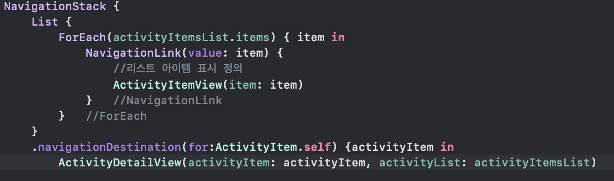
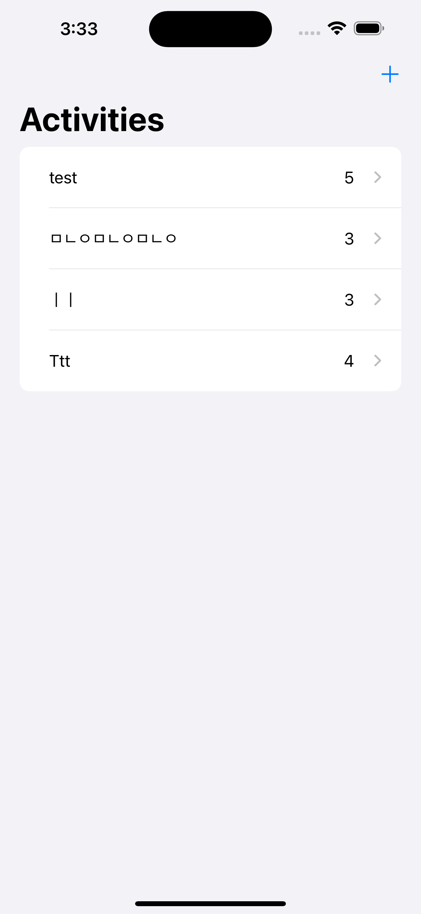
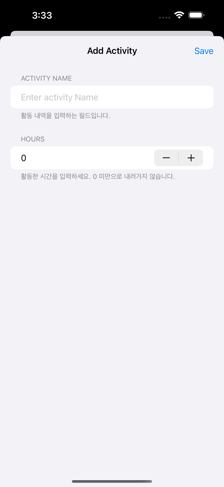
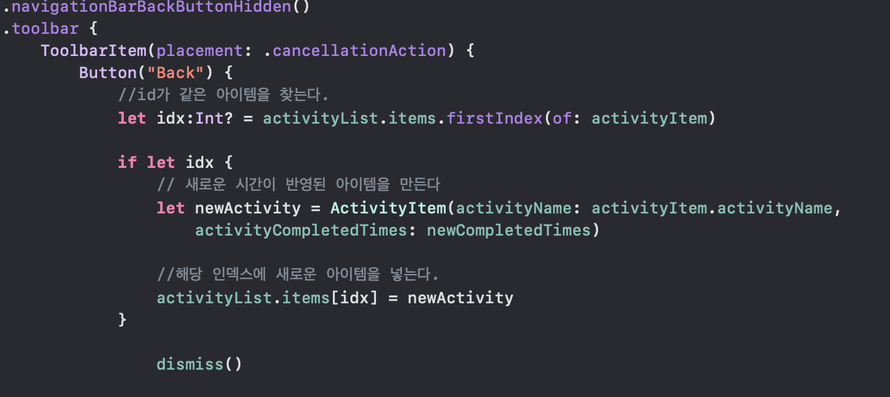
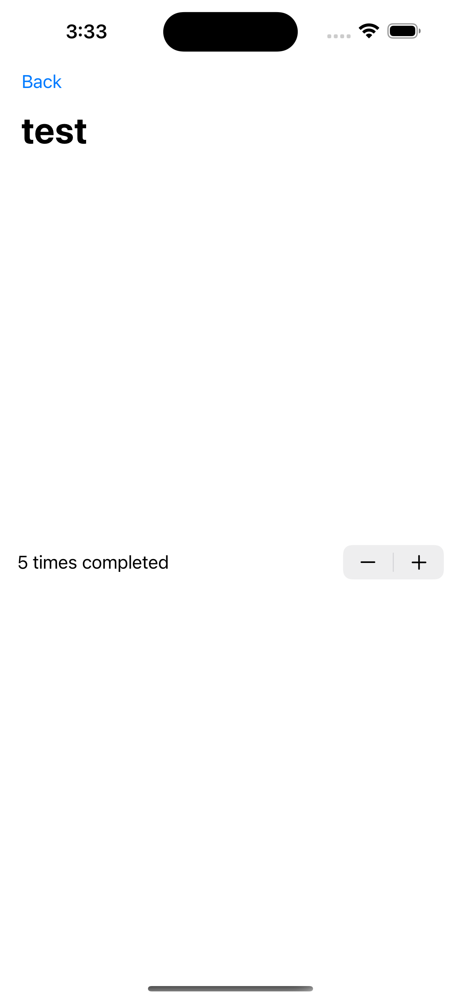

# Milestone: Projects 7~9

### Challenge

- habit-tracking 애플리케이션 제작
- `List`를 사용하여 활동을 추적
- `sheet()`을 사용하여 활동을 추가
- 세부 사항 확인을 위한 화면 이동, 완료 카운트를 추가하기 위한 버튼 추가

1. 활동 내용 저장을 위한 구조체와 클래스 정의

    활동 하나를 저장하기 위한 구조체인 `ActivityItem`을 구현했다. `ActivityItem`에는 활동의 이름과 몇 번 완료했는지를 저장하는 프로퍼티와, 리스트에서 각 항목을 구분하기 위한 UUID가 저장되어 있다.

    ```swift
    struct ActivityItem: Identifiable, Codable, Equatable, Hashable {
        var id = UUID()
        let activityName: String
        let activityCompletedTimes: Int
    }
    ```

    각 항목들을 구분하기 위해 `Identifiable`,  
    JSON 파일로 UserDefaults에 저장하기 위해 `Codable`,  
    리스트에서 해당 항목을 찾기 위해 `Equatable`,  
    NavigationLink 사용을 위해 `Hashable`을 준수한다.

    활동 구조체를 저장하기 위한 클래스인 `Activities`를 정의하고 `@Observable` 매크로를 사용했다.  
    iExpense와 구조는 큰 차이가 없다.


2. ContentView

    ContentView에서는 `List`와 `Sheet`, `toolbar`를 구현했다.

    

    


3. form

    활동을 추가하기 위한 sheet 안의 폼을 다른 파일에 구현했다.
    
    save 버튼을 탭하면 입력한 내용이 저장되며 리스트에도 표시된다.

    현재 아무것도 입력하지 않은 상태에서도 빈 문자열이 들어간다.

    


4. DetailView

    이 화면에서는 매우 간단하게 활동 이름과 활동한 시간을 확인할 수 있다.

    Stepper를 사용하여 활동 시간을 수정할 수 있다.

    `dismiss()`를 사용하여 이전 화면으로 되돌아갈 때 수정된 사항이 적용되도록 구현했고, 이를 위해 `navigationBarBackButtonHidden()`을 사용했다.
    
    <이전 화면으로 되돌아갈 시 변경 내역을 저장하는 로직>
    

    


