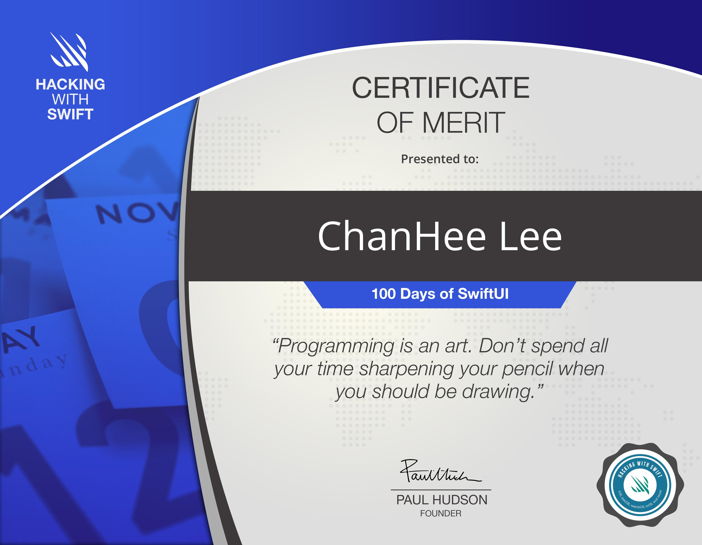

블로그에 글을 올리지는 않았지만..  

2023.09.11 ~ 2024.08.20

    
정답/오답

    

1. Correct   
2. Correct   
3. Correct   
4. Correct   
5. Correct   
6. Correct   
7. Correct   
8. Correct   
9. Correct   
10. Correct   
11. Correct   
12. Correct   
13. Correct   
14. Correct   
15. Correct   
16. Correct   
17. Correct   
18. Correct   
19. Correct   
20. Correct   
21. Wrong   
22. Correct   
23. Correct   
24. Correct   
25. Correct   
26. Correct   
27. Correct   
28. Correct   
29. Correct   
30. Correct   
31. Correct   
32. Correct   
33. Correct   
34. Correct   
35. Correct   
36. Correct   
37. Correct   
38. Correct   
39. Correct   
40. Wrong   
41. Correct   
42. Correct   
43. Correct   
44. Correct   
45. Correct   
46. Correct   
47. Correct   
48. Correct   
49. Correct   
50. Correct   
51. Correct   
52. Correct   
53. Correct   
54. Correct   
55. Correct   
56. Correct   
57. Wrong   
58. Wrong   
59. Correct   
60. Correct   
61. Correct   
62. Correct   
63. Correct   
64. Correct   
65. Correct   
66. Wrong   
67. Correct   
68. Correct   
69. Correct   
70. Correct   
71. Correct   
72. Correct   
73. Correct   
74. Correct   
75. Correct   
76. Wrong   
77. Correct   
78. Correct   
79. Wrong   
80. Correct   
81. Correct   
82. Correct   
83. Correct   
84. Wrong   
85. Correct   
86. Correct   
87. Correct   
88. Wrong   
89. Correct   
90. Correct   
91. Correct   
92. Correct   
93. Correct   
94. Correct   
95. Correct   
96. Correct   
97. Correct   
98. Correct   
99. Correct   
100. Correct 
    

